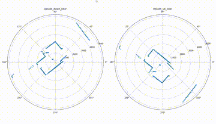

# Demos

## Environment SetUp (for Lidar Demo)

Basically you only need to pip install

- rplidar
- matplotlib

I've also exported my conda env to conda_win_env.yaml

run this to create a new environment from conda_win_env.yaml

```sh
conda env create -n [environment-name] -f conda_win_env.yaml
```

## Steps (for Lidar Demo)

Used [devices.py](devices.py) to identify the id/path of the lidar connected to the usb port. Put that id in run.py

```py
import matplotlib.animation as anim
from matplotlib.axes import Axes

PORT_NAME = "[DEVICE-ID-FROM-devices.py]"
lidar = RPLidar(PORT_NAME)
lidar_iter = iter(lidar.iter_scans(max_buf_meas=10000))


def process_data(data):
```

run [run.py](run.py)

